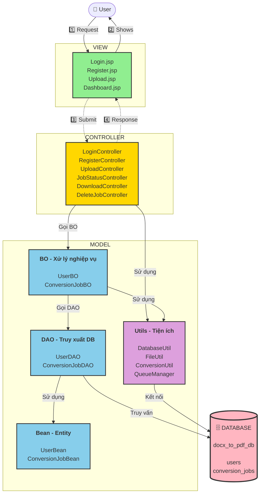
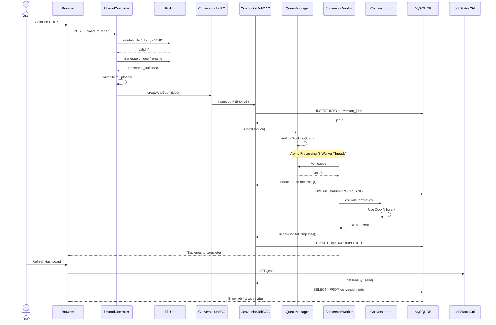
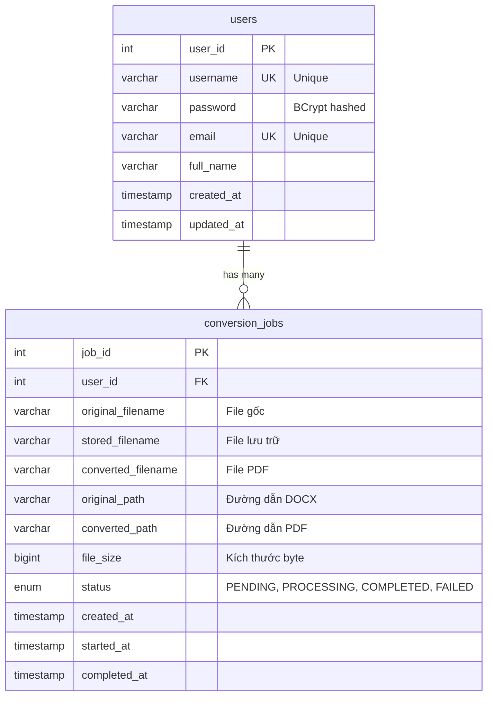
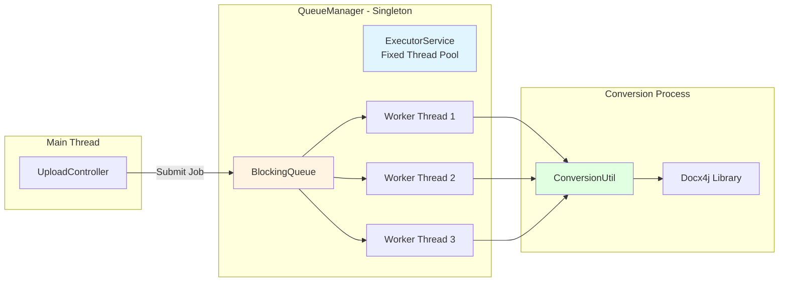
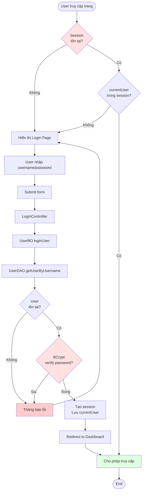
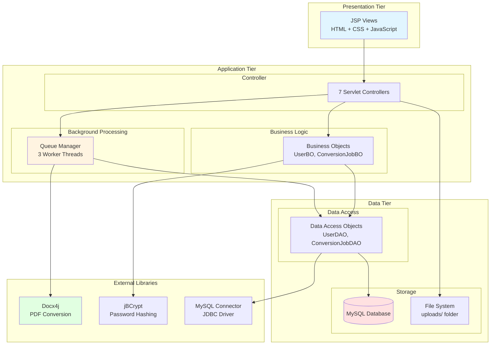
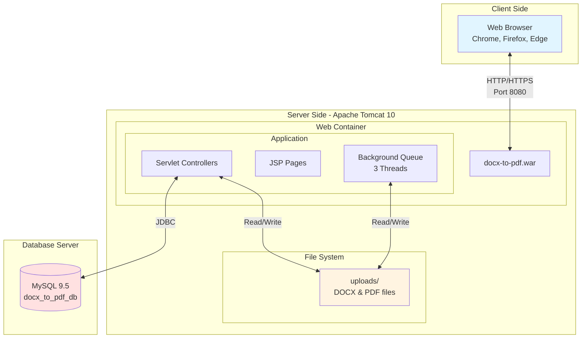
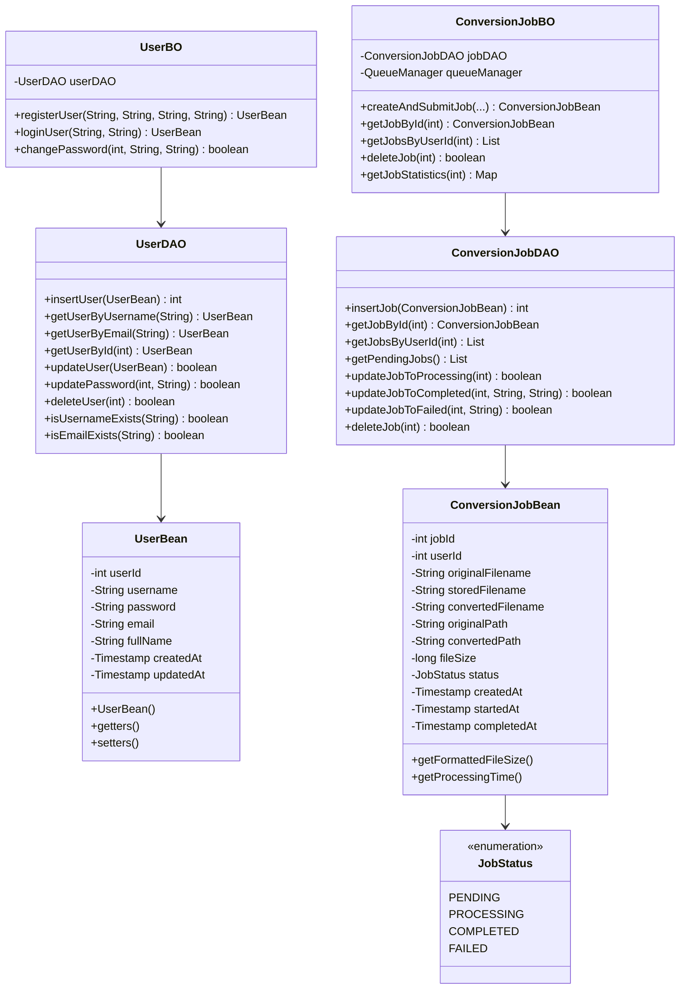

# Sơ Đồ Thiết Kế Hệ Thống - DOCX to PDF Converter

## Kiến Trúc MVC Pattern

---

## Giải Thích Kiến Trúc

### 📊 Các Tầng Chính

| Tầng | Mô tả | Thành phần |
|------|-------|------------|
| **VIEW** | Giao diện người dùng | JSP pages (Login, Register, Upload, Dashboard) |
| **CONTROLLER** | Xử lý request/response | Servlet Controllers (7 controllers) |
| **MODEL** | Xử lý logic và dữ liệu | BO (Business Object), DAO (Data Access), Bean (Entity), Utils |
| **DATABASE** | Lưu trữ dữ liệu | MySQL (users, conversion_jobs) |

### 🔄 Luồng Xử Lý

1. **User → View**: User truy cập giao diện web
2. **View → User**: Hiển thị form/nội dung
3. **View → Controller**: Submit request (login, upload, etc.)
4. **Controller → Model**: Gọi BO để xử lý nghiệp vụ
5. **Model → Database**: DAO truy vấn/cập nhật database
6. **Controller → View**: Trả về kết quả
7. **View → User**: Hiển thị kết quả

### 🛠️ Công Nghệ Sử Dụng

- **Jakarta EE Servlet 5.0**: Web framework
- **JSP + JSTL**: View rendering
- **MySQL 9.5**: Database
- **Docx4j**: DOCX → PDF conversion
- **jBCrypt**: Password hashing
- **BlockingQueue**: Background job processing (3 worker threads)
- **Apache Tomcat 10**: Application server

---

## Module Requests

| Module | Requests |
|--------|----------|
| **Auth** | Login, Logout, Register |
| **File** | Upload, Download, Delete |
| **Job** | View Status, Track Progress |

## Contacts Model

**BO (Business Object)**
- UserBO
- ConversionJobBO

**DAO (Data Access Object)**
- UserDAO - Truy xuất users table
- ConversionJobDAO - Truy xuất conversion_jobs table

**Controller gọi BO**
- Controller không gọi trực tiếp DAO
- Luôn đi qua BO để xử lý logic nghiệp vụ

---

## 2. Luồng Xử Lý Upload và Convert File (Chi Tiết)

## 3. Cấu Trúc Database Schema

## 4. Kiến Trúc Background Job Processing

## 5. Flow Chart - Quy Trình Xác Thực User

## 6. Component Diagram - Các Thành Phần Chính

## 7. Deployment Architecture

## 8. Class Diagram - Model Layer

## Tổng Kết Kiến Trúc

### Các Tầng Chính:

1. **View Layer (JSP)**: Giao diện người dùng
2. **Controller Layer (Servlets)**: Xử lý HTTP requests/responses
3. **Business Logic Layer (BO)**: Logic nghiệp vụ
4. **Data Access Layer (DAO)**: Truy cập database
5. **Entity Layer (Bean)**: Đối tượng dữ liệu
6. **Utils Layer**: Tiện ích hỗ trợ
7. **Background Processing**: Xử lý bất đồng bộ với Queue

### Công Nghệ Sử Dụng:

- **Jakarta EE Servlet 5.0**: Framework web
- **MySQL 9.5**: Database
- **Docx4j**: DOCX to PDF conversion
- **jBCrypt**: Mã hóa mật khẩu
- **BlockingQueue + ExecutorService**: Xử lý background jobs
- **Apache Tomcat 10**: Application server
